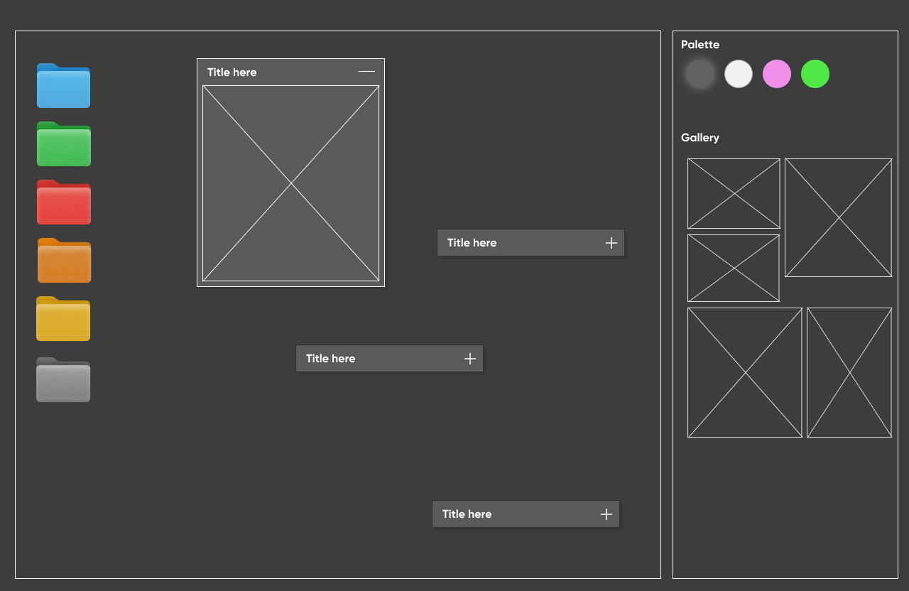
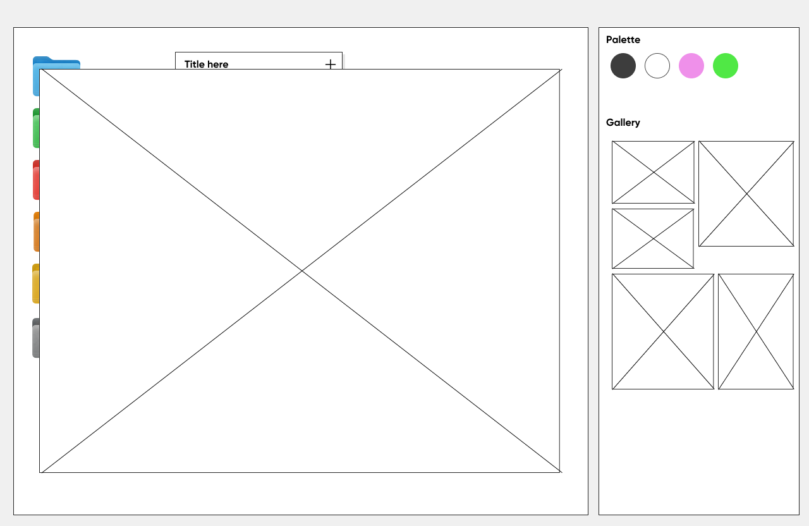

# dragndrop-S1

Dans le cadre du cours de Creative Coding à l’ICAN, ce projet consiste à expérimenter avec le glisser-déposer en utilisant la bibliothèque Dragabilly. L’idée est de créer des interactions fun et originales.

## My project

Ce projet est un portfolio fictif conçu pour un photographe souhaitant mettre en valeur ses créations, ses projets, et son univers visuel. L'idée était de marier une esthétique rétro, inspirée des interfaces de bureau vintage, avec une navigation moderne et intuitive. L'objectif principal est d'offrir une expérience utilisateur engageante et ludique, où les visiteurs peuvent explorer les œuvres du photographe en interagissant directement avec les éléments à l'écran.

La page principale du site est structurée en deux colonnes :

Une grande colonne gauche : elle représente un "bureau virtuel" interactif où les utilisateurs peuvent ouvrir, déplacer et redimensionner des fenêtres contenant des galeries d'images ou des dossiers de projets, recréant ainsi une ambiance nostalgique mais dynamique.

Une petite colonne droite : elle agit comme un panneau de contrôle et une galerie rapide, permettant à l'utilisateur de personnaliser l'apparence du site grâce à une palette de couleurs et de thèmes, tout en offrant un accès direct aux images sous forme de galerie.

Ce portfolio fictif met en avant une approche originale pour exposer des photographies, tout en créant une expérience immersive et unique pour les visiteurs.

## Lien Prototype Figma
*Normalement je vous ai donné l'accès, sinon faites moi une demande*
https://www.figma.com/proto/QaHrky1ARxf93gRp5gYJai/Untitled?page-id=0%3A1&node-id=35-1281&p=f&viewport=122%2C12%2C0.23&t=szGbhEhO5ElxGELF-1&scaling=scale-down&content-scaling=fixed&starting-point-node-id=35%3A1281

## Maquettes

## 🚀 About Me
Je suis étudiante en Web Design à l'ICAN :) 

## Authors

- [@NoaDufresne](https://github.com/NoaDufresne)

